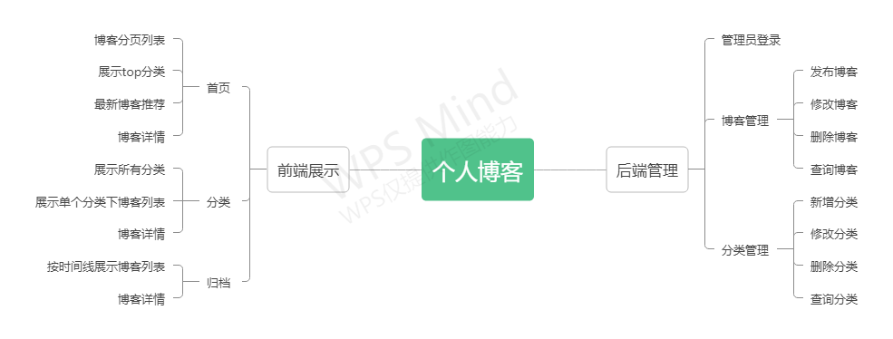
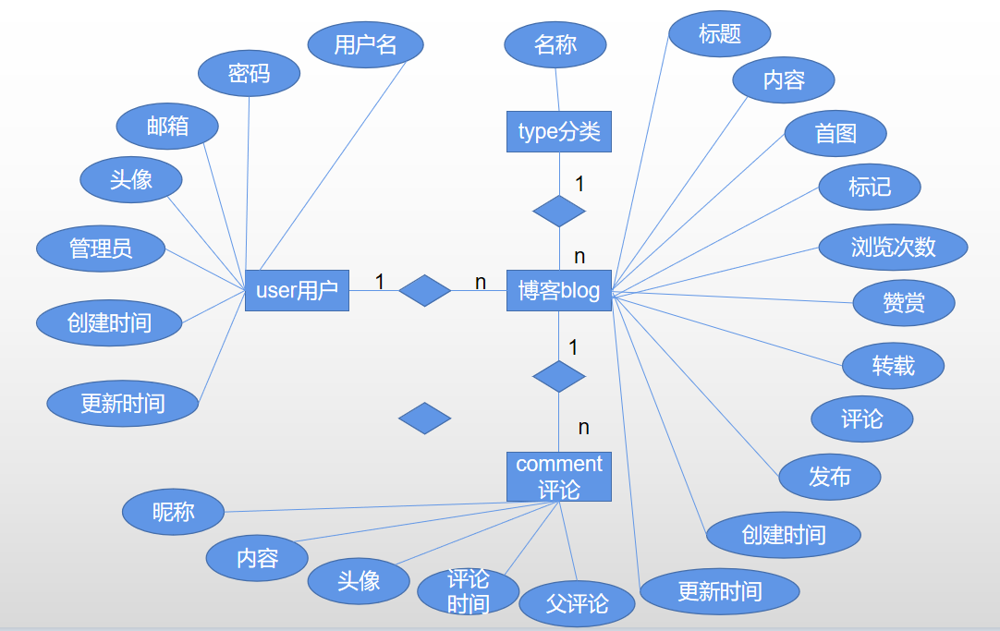

# blog

## 一、功能



基于spring boot + jwt + thymeleaf + mybatis + redis + mysql的个人博客

jwt登录验证，thymeleaf模板引擎渲染页面，mybatis框架简化数据库操作，redis做缓存

## 二、功能

角色：访客、管理员

### 访客

- 查看所有博客

- 查看所有分类

- 查看某个分类下的博客列表

- 根据年度时间线查看博客

- 全局搜索

- 评论

- 博客

- 扫码阅读博客


### 管理员

- 管理员登录

- 管理博客
  - 博客
    - 发布博客
    - 修改博客内容
    - 删除博客
    - 查询
  - 分类
    - 增加分类
    - 修改分类
    - 删除查询
    - 查询所有
  - 根据标题、分类、标签查看博客
  

## 三、文件树

```
E:.
│  .gitignore
│  blog.iml
│  pom.xml
│  README.md
│
├─.idea
│
├─imag     README.md 引用图片
│
├─src
│  ├─main
│  │  ├─java
│  │  │  └─com
│  │  │      └─hyb
│  │  │          │  BlogApplication.java
│  │  │          │
│  │  │          ├─aspect
│  │  │          │      LogAspect.java
│  │  │          │
│  │  │          ├─config
│  │  │          │      MVCConfig.java
│  │  │          │      RedisConfig.java
│  │  │          │
│  │  │          ├─controller
│  │  │          │  │  AboutController.java
│  │  │          │  │  ArchivesController.java
│  │  │          │  │  CommentController.java
│  │  │          │  │  IndexController.java
│  │  │          │  │  TypeShowController.java
│  │  │          │  │
│  │  │          │  └─admin
│  │  │          │          BlogController.java
│  │  │          │          LoginController.java
│  │  │          │          TypeController.java
│  │  │          │
│  │  │          ├─handler
│  │  │          │      ControllerExceptionHandler.java
│  │  │          │
│  │  │          ├─interceptor
│  │  │          │      JWTInterceptor.java
│  │  │          │
│  │  │          ├─mapper
│  │  │          │      BlogMapper.java
│  │  │          │      CommentMapper.java
│  │  │          │      TypeMapper.java
│  │  │          │      UserMapper.java
│  │  │          │
│  │  │          ├─pojo
│  │  │          │      Blog.java
│  │  │          │      Comment.java
│  │  │          │      Type.java
│  │  │          │      User.java
│  │  │          │
│  │  │          ├─service
│  │  │          │  │  BlogService.java
│  │  │          │  │  CommentService.java
│  │  │          │  │  TypeService.java
│  │  │          │  │  UserService.java
│  │  │          │  │
│  │  │          │  └─impl
│  │  │          │          BlogServiceImpl.java
│  │  │          │          CommentServiceImpl.java
│  │  │          │          TypeServiceImpl.java
│  │  │          │          UserServiceImpl.java
│  │  │          │
│  │  │          └─utils
│  │  │                  CookieUtils.java
│  │  │                  IpInfoUtils.java
│  │  │                  JWTUtils.java
│  │  │                  MarkdownUtils.java
│  │  │                  MD5Utils.java
│  │  │                  RedisUtils.java
│  │  │                  ThreadPoolUtils.java
│  │  │
│  │  └─resources
│  │      │  application.yml
│  │      │
│  │      ├─com
│  │      │  └─hyb
│  │      │      └─mapper
│  │      │              BlogMapper.xml
│  │      │              CommentMapper.xml
│  │      │              TypeMapper.xml
│  │      │              UserMapper.xml
│  │      │
│  │      ├─i18n
│  │      │      messages.properties
│  │      │
│  │      ├─static  前端静态资源文件
│  │      │
│  │      └─templates
│  │          │  about.html
│  │          │  archives.html
│  │          │  blog.html
│  │          │  index.html
│  │          │  search.html
│  │          │  tags.html
│  │          │  types.html
│  │          │
│  │          ├─admin
│  │          │      blogs-input.html
│  │          │      blogs.html
│  │          │      index.html
│  │          │      login.html
│  │          │      types-input.html
│  │          │      types.html
│  │          │
│  │          ├─commons
│  │          │      bar.html
│  │          │
│  │          └─error
│  │                  404.html
│  │                  500.html
│  │                  error.html
│  │
│  └─test
│      └─java
│          └─com
│              └─hyb
│                      BlogApplicationTests.java
│
└─target
```

## 四、详情

### 1.数据库ER图



### 2.md编辑器-editormd

> https://pandao.github.io/editor.md/

```html
<div class="field">
    <div id="md-content" style="z-index: 1 !important;"><!--将markdown文本框放到最上方以免全屏布局错乱-->
        <textarea name="content" placeholder="博客内容" style="display: none;">
            ### Disabled options
            - TeX (Based on KaTeX);
            -Emoji;
            -Task lists;
            -HTML tags decode;f
        </textarea>
    </div>
</div>
```

```js
//初始化Markdown编辑器
    var contentEditor;
    $(function () {
        contentEditor = editormd("md-content",{
            width:"100%",
            height:640,
            syncScrolling:"single",
            path:"../lib/editormd/lib/"  //路径一定要正确
        });
    });
```

### 3.异常处理

```java
/*
 * @ControllerAdvice是在类上声明的注解，其用法主要有三点：
 *      @ExceptionHandler注解标注的方法：用于捕获Controller中抛出的不同类型的异常，从而达到异常全局处理的目的；
 *      @InitBinder注解标注的方法：用于请求中注册自定义参数的解析，从而达到自定义请求参数格式的目的；
 *      @ModelAttribute注解标注的方法：表示此方法会在执行目标Controller方法之前执行
 */
@ControllerAdvice
public class ControllerExceptionHandler {

    private Logger logger = LoggerFactory.getLogger(ControllerExceptionHandler.class);

    @ExceptionHandler(Exception.class) //异常处理
    public ModelAndView exceptionHandler(HttpServletRequest request, Exception e) {
        logger.error("Request Url : {}, exception : {}", request.getRequestURL(), e); //打印访问的url和异常信息
        ModelAndView mv = new ModelAndView();
        mv.addObject("url", request.getRequestURL());
        mv.addObject("exception", e);
        mv.setViewName("error/error");
        return mv;
    }
}
```

### 4.日志处理

```java
@Aspect
@Component
public class LogAspect {

    private Logger logger = LoggerFactory.getLogger(this.getClass());

    @Pointcut("execution(* com.hyb.controller.*.*(..))")
    public void log() {}

    @Around("log()")
    public Object around(ProceedingJoinPoint pcj) {
        Object rtVal = null;

        ServletRequestAttributes attributes = (ServletRequestAttributes) 	RequestContextHolder.getRequestAttributes();
        HttpServletRequest request = attributes.getRequest();
        String url = request.getRequestURL().toString();

        String ip = IpInfoUtils.getIpAddr(request);
        //类名+方法名
        String classMethod = pcj.getSignature().getDeclaringTypeName() + "." + pcj.getSignature().getName();
        Object[] args = pcj.getArgs();
        RequestLog requestLog = new RequestLog(url, ip, classMethod, args);
        logger.info("Request : {}" ,requestLog);

        try {
            rtVal = pcj.proceed();  //明确切入点方法的调用
        } catch (Throwable throwable) {
            throwable.printStackTrace();
        } finally {
            logger.info("Result : {}", rtVal);
        }
        return rtVal;
    }
}
```

### 5.JWT

#### 1.介绍

JWT的构成：头部（header),载荷（payload)，签证（signature).

- header：
       声明类型，这里是jwt
       声明加密的算法 通常直接使用 HMAC SHA256
- playload：
  - 标准中注册的声明：
    - iss: jwt签发者
    -  sub: jwt所面向的用户
    - aud: 接收jwt的一方
    - exp: jwt的过期时间，这个过期时间必须要大于签发时间
    - nbf: 定义在什么时间之前，该jwt都是不可用的.
    - iat: jwt的签发时间
    -  jti: jwt的唯一身份标识，主要用来作为一次性token,从而回避重放攻击。
  - 公共的声明：公共的声明可以添加任何的信息，一般添加用户的相关信息或其他业务需要的必要信息.该部分在客户端可解密.
  - 私有的声明：私有声明是提供者和消费者所共同定义的声明，一般不建议存放敏感信息，因为base64是对称解密的，意味着该部分信息可以归类为明文信息。

- signature：这个部分需要base64加密后的header和payload使用`.`连接组成的字符串，然后通过header中声明的加密方式进行加盐secret组合加密，然后就构成了jwt的第三部分
  - header (base64后的)
  - payload (base64后的)
  - secret:它就是你服务端的私钥，在任何场景都不应该流露出去。一旦客户端得知这个secret, 那就意味着客户端是可以自我签发jwt了

#### 2.token工具类

```java
public class JWTUtils {

    /**
     * 过期时间为1天
     */
    private static final long EXPIRE_TIME = 24*60*60*1000;

    /**secret是保存在服务器端的，jwt的签发生成也是在服务器端的，secret就是用来进行jwt的签发和jwt的验证，
     * 它就是你服务端的私钥，在任何场景都不应该流露出去。一旦客户端得知这个secret, 那就意味着客户端是可以自我签发jwt了
     * token私钥
     */
    private static final String TOKEN_SECRET = "joijsdfjlsjfljfljl5135313135";

    public static String createToken(User user) {
        //过期时间
        Date date = new Date(System.currentTimeMillis() + EXPIRE_TIME);  //前面加上currentTimeMillis来保证每次生成的token不一样

        //私钥及加密算法
        Algorithm algorithm = Algorithm.HMAC256(TOKEN_SECRET);

        //设置头信息
        Map<String, Object> header = new HashMap<>(2);
        header.put("typ", "JWT");
        header.put("alg", "HS256");

        /*
	  Algorithm 用来指定签名算法，常用的是HMAC256，加密因子可以是固定值，也可以是变量。
	  withClaim指定签名里面存储的一些基本信息。传入payload
	  withExpiresAt指定过期时间。
	  withIssuedAt指定签发时间。
	  withHeader指定token头，里面包含typ和alg，常用信息为JWT和HS256
	  sign 是signature
	  最终产生的token为base64url(header)+.+base64url(playload)，然后再用head里面指定的算法进行加密，获取对应token信息。
	 */
        String token = JWT.create().withHeader(header)
                .withClaim("id", String.valueOf(user.getId())).withClaim("username", user.getUsername())
                .withClaim("avatar", user.getAvatar()).withClaim("email", user.getEmail())
                .withExpiresAt(date).sign(algorithm);

        return token;
    }

    /*
    解密之后获取到的是DecodedJWT类，通过getClaims()方法可以获取token里面存储的信息。
    获取该类需要调用JWTVerifier 的verify方法。
    获取JWTVerifier 类需要通过require().build()获取
     */
    public static DecodedJWT verifyToken(String token) throws Exception {
        Algorithm algorithm = Algorithm.HMAC256(TOKEN_SECRET);
        JWTVerifier verifier = JWT.require(algorithm).build();
        //DecodedJWT 将jwt解密 将xxx.yyy.zzz 分开
        return verifier.verify(token);
    }

    public static String parserToken(String token, String claim) {
        return JWT.decode(token).getClaim(claim).asString();//可以获取token里面存储的信息
    }
}

```

#### 3.验证token

```java
public class JWTInterceptor implements HandlerInterceptor {

    @Override
    public boolean preHandle(HttpServletRequest request, HttpServletResponse response, Object handler) throws Exception {

        try {
            //这里token通过cookie传输
            Cookie cookie = CookieUtils.get(request, "token");
            String token = cookie.getValue();
            JWTUtils.verifyToken(token);//验证token令牌
            //验证成功

            //服务器重启 session没了 但是token未失效  这是将用户信息重新设置到session中

            //拿到token payload中的username
            HttpSession session = request.getSession();

            String username = JWTUtils.parserToken(token, "username");
            String avatar = JWTUtils.parserToken(token, "avatar");
            String email = JWTUtils.parserToken(token, "email");
            String id = JWTUtils.parserToken(token, "id");
            Long userId = Long.parseLong(id);
            //放在session中
            User user = new User();
            user.setId(userId);
            user.setUsername(username);
            user.setAvatar(avatar);
            user.setEmail(email);
            session.setAttribute("user", user);
            return true;  //放行
        } catch (SignatureVerificationException e) {
            e.printStackTrace();
            System.out.println("无效签名");
        } catch (TokenExpiredException e) {
            e.printStackTrace();
            System.out.println("token过期");
        } catch (AlgorithmMismatchException e) {
            e.printStackTrace();
            System.out.println("token算法不一致");
        } catch (Exception e) {
            e.printStackTrace();
            System.out.println("token无效");
        }

        CookieUtils.delete(request, response, "token");
        HttpSession session = request.getSession(); //清除用户信息
        session.removeAttribute("user");

        if (CookieUtils.get(request, "tokenInvalid") == null) {
            CookieUtils.set(response, "tokenInvalid", "请先登录", -1);
        }

        response.sendRedirect("/admin");
        return false;  //拦截
    }
}
```

### 6.redis缓存

1.使用hash缓存blog

```java
//key field value
 "blog"  id   blog各个字段及属性
```

2.zset + hash 缓存分页

```java
//zset存储所有blog的id
//key scores member
"blog:page" blog的id blog的id
//根据id查询hash缓存的blog
```

3.hash缓存所有分类

```java
//key field value
"type"  id   type各个字段及属性
```

4.zset排行榜 ranking

```java
"type_blogs"   type的id   一个type的blog数量
```


## 问题

1.页面接在很慢

F12后发现，时间浪费在https://fonts.googleapis.com/css?family=Lato:400,700,400italic,700italic&subset=latin上，这是个谷歌字体，服务器在外国，请求半天最终结果是无法访问；

解决办法：将字体下载到本地，将senamtic.min.css也下载到本地。


